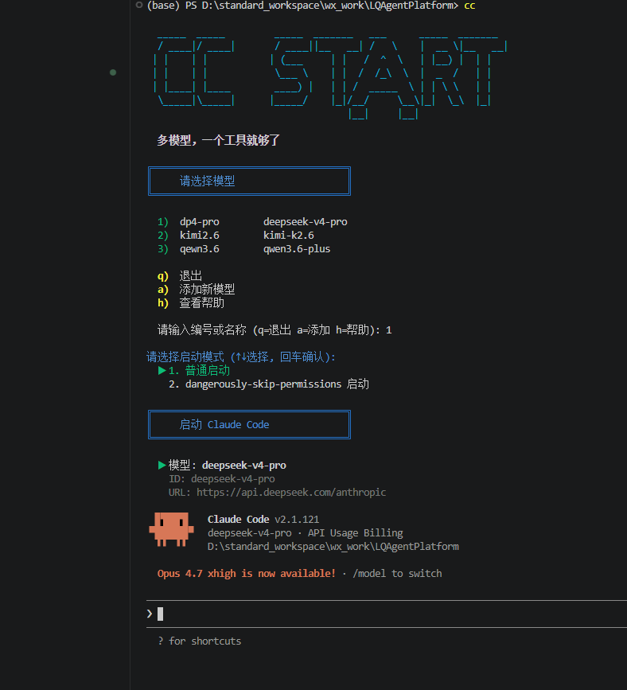

# CC Start

```
  _____  _____         _____  _______   ___      _____  _______ 
  / ____|/ ____|       / ____||__   __| /   \    |  __ \|__   __|
 | |    | |           | (___     | |   /  ^  \   | |__) |  | |   
 | |    | |            \___ \    | |  /  /_\  \  |  _  /   | |   
 | |____| |____        ____) |   | | /  _____  \ | | \ \   | |   
  \_____|\_____|      |_____/    |_|/__/     \__\|_|  \_\  |_|   
                                    |__|     |__|                
```

**一条命令，终结 Claude Code 的上手门槛。多模型，一个工具就够了。**

> 🍴 Forked from [wandanan/cc_start](https://github.com/wandanan/cc_start) · 基于 MIT 协议二次发布

---

## 为什么选择 CC Start？

Claude Code 默认只认 Anthropic 自家模型——想用国产大模型？环境变量、配置文件、每个窗口各自为战，稍不留神全面冲突。

CC Start 让你彻底告别这些折腾：

| | |
|---|---|
| 🚀 **一条命令装好一切** | 自动检测 & 安装 Node.js、Claude Code，脚本直达 PATH，安装即用，零手动 |
| 🎯 **多模型无缝切换** | `cc kimi` → `cc qwen` → `cc glm` — 一条命令换模型，比切歌还流畅 |
| 🪟 **多窗口独立运行** | 每个终端独立配置互不干扰，4 个窗口跑 4 个模型，随心所欲 |
| ➕ **任意模型随心加** | `cc add` 三步上手，兼容任何 Claude API 服务，不挑品牌不限数量 |
| 🌍 **全平台统一体验** | Windows / macOS / Linux 通吃，CMD、PowerShell、Bash 全支持 |

## 一分钟安装

> **桌面版用户**：CC Start Desktop 安装包已附带 `cc` / `ccs` 命令行启动器，装一个安装包即可同时拥有 GUI 和命令行。下面的 `install.bat` / `install.sh` 是**只想单独装 CLI、不装 GUI** 时用。

```bash
git clone https://github.com/1908490231/cc_start.git && cd cc_start

# Windows → 双击运行
install.bat

# Mac / Linux → 终端执行
chmod +x install.sh && ./install.sh
```

安装脚本自动完成：

```
✅ 检测 & 自动安装 Node.js / Claude Code（缺失时）
✅ 复制启动脚本到系统 PATH
✅ 创建配置目录，预置模型配置模板
✅ 自动注册 cc 和 ccs 两个命令
✅ Windows 自动配置 PATH，无需手动操作
```

> **macOS 用户注意**：系统自带 bash 版本为 3.2，不支持关联数组。请先通过 Homebrew 安装新版 bash：
> ```bash
> brew install bash
> ```
> Linux 用户无需此步骤，系统自带 bash 4.0+ 已满足要求。

> **安装后提示命令找不到？** Windows 安装程序会自动添加 PATH，但如果失效请手动添加：
> `系统属性 → 环境变量 → 编辑用户 PATH → 新建 → %USERPROFILE%\.local\bin`

## 快速开始

安装完成后会得到 4 个预置模型模板（`kimi` / `qwen` / `glm` / `mini`），位于 `~/.claude/models/`。每个模板的 `ANTHROPIC_AUTH_TOKEN` 是占位符，**先填上自己的 API Key 才能启动**：

```bash
# 给某个预置模型填 API Key（编辑器里改 ANTHROPIC_AUTH_TOKEN 即可）
cc edit kimi

# 交互式选择模型启动
cc

# 或直接指定模型
cc kimi
cc qwen

# 添加自己的模型配置
cc add
```

```bash
$ cc

╔═══════════════════════════════════╗
║     请选择模型                    ║
╚═══════════════════════════════════╝

  1)  glm            glm-5
  2)  kimi           kimi-k2.5
  3)  mini           MiniMax-M2.5
  4)  qwen           qwen3.5-plus

  q)  退出
  a)  添加新模型
  h)  查看帮助

  请输入编号或名称 (q=退出 a=添加 h=帮助): 2

请选择启动模式 (↑↓选择, 回车确认):

  ▶ 1. 普通启动
    2. dangerously-skip-permissions 启动

🚀 启动 Claude Code [kimi]...
```

## 命令详解

| 命令 | 说明 |
|---|---|
| `cc` | 交互式选择模型启动（↑↓ 方向键 + 回车确认） |
| `cc <模型名>` | 跳过菜单，直接启动指定模型 |
| `cc add` | 添加新模型配置（三步走：名称 → Key → URL） |
| `cc edit [模型名]` | 编辑已有模型配置 |
| `cc remove [模型名]` | 删除模型配置 |
| `cc ls` | 列出所有已配置模型 |
| `cc sync [模型名]` | 同步当前 MCP/插件配置到指定模型 |
| `cc upgrade` | 升级 DeepSeek 系列配置补齐扩展字段（`[1m]` 后缀、AUTO_COMPACT_WINDOW、EFFORT_LEVEL、SUBAGENT_MODEL） |
| `cc reset` | 清空所有模型配置 |
| `cc -h` | 查看帮助 |

> 💡 `cc` 和 `ccs` 完全等价。Linux 系统默认有 `/usr/bin/cc`（C 编译器），若需区分使用 `ccs` 即可。

## 支持的模型

预置 4 个国产大模型配置模板，填入 API Key 即刻启动：

| | 命令 | 模型 | 提供商 |
|---|---|---|---|
| 🔵 | `cc kimi` | Kimi K2.5 | Moonshot |
| 🟢 | `cc qwen` | 千问 3.5 Plus | Alibaba |
| 🟣 | `cc glm` | GLM 5 | Zhipu |
| 🟠 | `cc mini` | MiniMax M2.5 | MiniMax |
| ⚪ | `cc <自定义>` | 任意模型 | 任意兼容 Claude API 的服务 |

```bash
# 打开 4 个终端，各跑各的

终端 1 > cc kimi     # Kimi K2.5
终端 2 > cc qwen     # 千问 3.5 Plus
终端 3 > cc glm      # GLM 5
终端 4 > cc mini     # MiniMax M2.5
```

> 🔒 每个窗口独立配置，互不干扰，互不打架。

## 添加你自己的模型

`cc add` 支持添加任意兼容 Claude API 的模型。按提示依次输入即可：

- **启动命令名称**：如 `deepseek`，之后用 `cc deepseek` 或 `ccs deepseek` 启动
- **模型 ID**：如 `deepseek-v3`
- **API Key**：输入时不回显，保护隐私
- **Base URL**：API 端点地址，如 `https://api.deepseek.com/anthropic`

```bash
cc add
```

重复 `cc add` 可添加多个模型。

### 删除模型

```bash
cc remove          # 交互式选择（显示编号列表）
cc remove kimi     # 直接指定模型名
```

交互模式下输入编号或名称均可选中，输入 `q` 退出。

### 备选方式：复制修改

```bash
cp ~/.claude/models/kimi.json ~/.claude/models/myai.json
# 编辑文件，修改 API Key
```

然后输入 `cc myai` 或 `ccs myai` 即可启动。

## 使用示例

```bash
cc               # 交互式选择模型
ccs              # 等效命令
cc kimi          # 直接启动 Kimi
ccs kimi         # 等效命令
cc qwen          # 在另一个窗口启动 Qwen
cc myai          # 启动自定义模型
```

**多窗口同时使用**：

```bash
# 终端 1
cc kimi

# 终端 2（同时运行）
cc qwen

# 终端 3（同时运行）
cc glm
```

每个窗口独立使用不同模型，配置互不干扰。

## 手动安装（备选）

如果不想用自动安装脚本，只需两步：

**Step 1: 把脚本放入 PATH**

方案 A - 复制到系统目录：
```bash
mkdir -p ~/.local/bin

# Mac / Linux：cc 是 bash 脚本，ccs 用软链接指向 cc 即可
cp cc ~/.local/bin/cc
ln -sf ~/.local/bin/cc ~/.local/bin/ccs

# Windows（在 Git Bash 里跑）：CMD 用 .cmd，PowerShell 用 .ps1
cp cc cc.cmd cc.ps1 ccs.cmd ccs.ps1 ~/.local/bin/
```

方案 B - 直接把本项目目录加入 PATH：
```bash
# 编辑 ~/.bashrc 或 ~/.zshrc，添加
export PATH="$PATH:/path/to/cc_start"
```

**Step 2: 复制模型配置到 Claude 配置目录**

```bash
mkdir -p ~/.claude/models
cp models/*.json ~/.claude/models/
# 然后编辑这些 json 文件，填入你的 API Key
```

## 配置说明

配置文件格式（`~/.claude/models/任意名称.json`）：

```json
{
  "env": {
    "ANTHROPIC_AUTH_TOKEN": "your-api-key",
    "ANTHROPIC_BASE_URL": "https://api.example.com/anthropic",
    "ANTHROPIC_MODEL": "model-name"
  }
}
```

## 工作原理

CC Start 通过 Claude Code 的 `--settings` 参数为每个实例指定独立的配置文件：

```bash
claude --settings ~/.claude/models/kimi.json
claude --settings ~/.claude/models/qwen.json
```

每个窗口使用自己的配置，**多窗口同时运行互不干扰**。

> 旧版本使用替换 `settings.json` 的方式，已改为 `--settings` 参数方案，支持多窗口独立运行。

## 更新日志

### 2026-05-21 · 修复

- 修复 Windows 下 `cc <model>` 启动后报 `SessionStart:startup hook error / UnexpectedToken session-start` 的问题
- 根因：cc.cmd / ccs.cmd 4 层 fallback 自动发现 Git 时只选 MINGW64 `bin\bash.exe`，导致 Claude Code 内部 spawn 的 hook 命令被 PowerShell 解析失败
- 修复：每层 fallback 全部改为优先 MSYS `usr\bin\bash.exe`，再 fallback `bin\bash.exe`
- 同步更新桌面版 NSIS 安装包的 SecCli 预检逻辑（与 cc.cmd 保持一致）
- 升级方法：CLI 用户重新跑 `install.bat`；桌面版用户重装最新安装包并勾选"安装命令行启动器"
- 详见后文"故障排查"小节

### 2026-05-19 · Fork

- 基于上游 [wandanan/cc_start](https://github.com/wandanan/cc_start) v1.0.0 fork
- 仓库地址迁移至 [1908490231/cc_start](https://github.com/1908490231/cc_start)

### 2026-04-28 · v1.0.0

- 发布 CC Start 首个正式版本
- 提供 CLI 多模型启动器
- 新增 Windows 桌面版（GUI）
- CLI 与桌面版共享同一份模型配置
- 支持图形化管理、编辑、复制、删除模型配置
- 支持工作目录选择、一键启动与连通性测试
- 支持原始 JSON 编辑与保存

## 依赖

- [Claude Code](https://claude.ai/code) — 安装脚本会自动检测并在缺失时通过 npm 安装
- Git Bash (Windows) 或 Bash 4.0+ (Mac/Linux)
  - **macOS**：系统自带 bash 3.2，需通过 Homebrew 安装：`brew install bash`
  - **Linux**：主流发行版（Ubuntu/Debian/Fedora/CentOS 等）自带 bash 4.x/5.x，无需额外安装

## 桌面版（GUI）

CC Start 也提供图形界面版本，适合不想记命令、希望可视化管理配置的用户。

> **重要说明**：CC Start Desktop 不是独立的 AI 客户端，而是 **Claude Code 的图形启动器**。使用前需先在本机安装 Claude Code。

### 下载安装

1. 先安装 Claude Code
2. 到 [CC Start Desktop Releases](https://github.com/1908490231/cc_start/releases) 页面下载安装包
3. Windows 用户下载 **Setup.exe**（NSIS 安装包，已附带 `cc` / `ccs` 命令行启动器）
4. 安装完成后打开桌面版，即可查看、添加、编辑并启动模型配置

### 当前版本支持

- 可视化查看模型配置列表
- 新增、编辑、复制、删除配置
- 删除到回收站（保留最近删除记录）
- 可视化选择工作目录
- 普通启动 / 跳过权限确认 切换
- 一键启动 Claude Code
- 原始 JSON 编辑
- JSON 语法高亮显示
- 连通性测试（发送最小请求测试，可能消耗少量 token）
- 记住上次启动的配置

### CLI 与桌面版共存

命令行版（CLI）和桌面版可以同时安装，互不影响：

- **CLI**：`cc` / `ccs` 命令，终端操作
- **桌面版**：图形界面，鼠标操作
- **共享配置**：两者读写同一份 `~/.claude/models/*.json`，在任一端添加的模型在另一端立即可见
- **启动原理一致**：两者最终都是通过 `claude --settings <配置文件>` 启动 Claude Code

### 开发模式运行

如果想参与开发或自行编译：

```cmd
cd desktop
npm install
npm run tauri dev
```

### 打包桌面版

Windows 下打包命令：

```cmd
cd desktop
npm install
npm run tauri build
```

打包完成后，安装包通常位于：

```text
desktop/src-tauri/target/release/bundle/
```

常见产物包括：

- `nsis/`：Setup 安装包（NSIS，附带 cc / ccs 命令行启动器）

## 卸载与清理

桌面版从 Windows 控制面板"添加/删除程序"卸载。卸载向导会出现两个组件：

- **CC Start 桌面版（必卸）**：不可取消，卸载本体的所有逻辑
- **同时移除 cc 命令行启动器**：**默认勾选**，按 5 个固定文件名（`cc` / `cc.cmd` / `cc.ps1` / `ccs.cmd` / `ccs.ps1`）从 `%USERPROFILE%\.local\bin\` 删除

卸载器**不会**：

- 修改 PATH 环境变量（`.local\bin` 目录可能服务其他工具，无法判断条目原本是谁加的）
- 删除 `%USERPROFILE%\.local\bin\` 目录本身（同上）
- 触碰 `%USERPROFILE%\.claude\` 任何文件（你的模型配置 `~/.claude/models/*.json` 永远保留）

如果你要彻底清理配置，请**手动删除** `%USERPROFILE%\.claude\models\` 目录。

### 老用户 PATH 重复条目自查

如果你既用过仓库根目录的 `install.bat`、又装过桌面版，PATH 中可能有**多条** `%USERPROFILE%\.local\bin` 记录（来自不同时期、不同形式的展开/未展开版本）。这不影响 `cc` 命令使用，但视觉上有点乱。可手动整理：

```powershell
# 查看当前 HKCU PATH 中 .local\bin 条目数
($env:Path -split ';' | Select-String '\.local\\bin').Count

# 查看详细位置
[Environment]::GetEnvironmentVariable("Path", "User")
```

如果 Count > 1，去"系统属性 → 环境变量 → 用户变量 Path → 编辑"手动删除重复条目，保留任意一条即可。

## 故障排查

### Windows：`cc <model>` 启动后报 SessionStart hook 错

**现象**：cmd.exe 里跑 `cc kimi` / `cc mini` 等命令，Claude Code 启动后顶部出现：

```
SessionStart:startup hook error
Failed with non-blocking status code
UnexpectedToken session-start
```

模型本身能用，但 Superpowers / 插件类 hook 注入功能可能失效。

**原因**：旧版 cc.cmd / ccs.cmd 在某些 Git 安装环境下选到了 MINGW64 `bin\bash.exe`。这个 bash 启动 Claude Code 后，Claude Code 内部 spawn 的 hook 命令 `"path\run-hook.cmd session-start"` 会被 PowerShell 解析，而 PowerShell 不能直接执行带参数的 `.cmd` 路径（需要 `&` 前缀），所以报 `UnexpectedToken`。MSYS `usr\bin\bash.exe` 不会触发。

**解决**：升级到 2026-05-21 之后版本。新版 cc.cmd / ccs.cmd 4 层 fallback 已改为优先 MSYS `usr\bin\bash.exe`。

- **CLI 单装**：在仓库根目录重新跑 `install.bat`
- **桌面版用户**：到 [Releases](https://github.com/1908490231/cc_start/releases) 下载最新版安装包，安装时勾选"安装命令行启动器（cc 命令）"

升级后旧 cc.cmd / ccs.cmd 会被覆盖，下次启动 Claude Code 不会再报这个错。

## Star History

如果这个项目对你有帮助，请给个 ⭐ Star！

[](https://star-history.com/#1908490231/cc_start&Date)

## License

MIT

---

<p align="center">
  <b>如果这个项目对你有帮助，点个 ⭐ Star 就是最大的鼓励！</b>
</p>

[](https://star-history.com/#1908490231/cc_start&Date)
